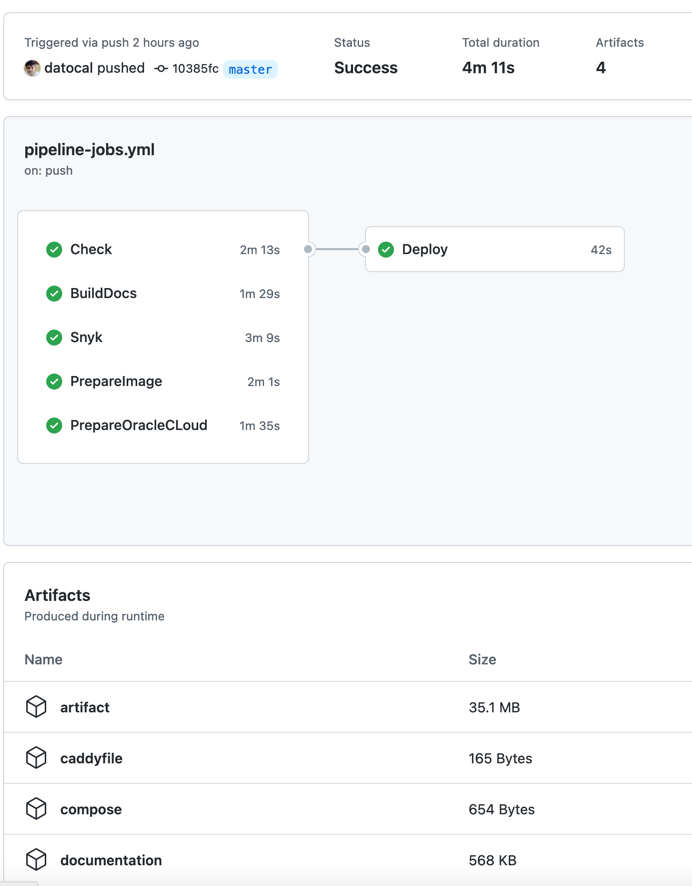

# Quick View

This project contains a full pipeline from 0 to production using Github Actions.

There is a bunch of pipelines configured but the important one is the pipeline-jobs pipeline.

 * Generate Docs: This pipeline only generates the docs. But the main one generates them too when pushing to master, so it's useless
 * Mutation Tests: This pipeline runs the mutation tests and generates a report showing the real coverage.
 * CI: This is the main pipeline with parallel jobs, infrastructure creation and deploy to production.
 * Termination: This pipeline terminates all the resources in the cloud.
 * pages-build-deployment: Pipeline generated by the buildDocs step on the main pipeline to deploy the documentation on gh pages.

The following image shows the current jobs for the main pipeline:

## Generated artifacts

 * compose: The docker-compose file. Used in the deployment to launch the docker images
 * documentation: The documentation site in a compressed zip file.
 * artifact: The jar containing the NoLocal Spring Boot application.
