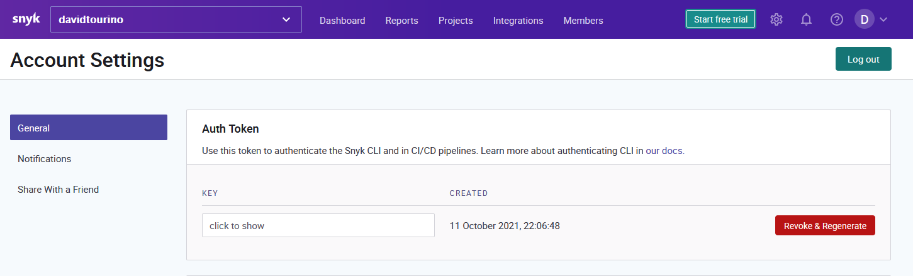
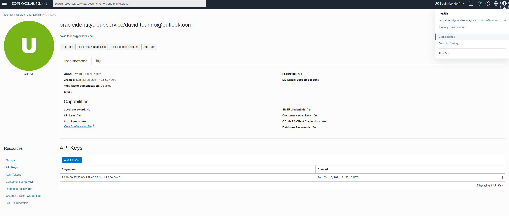
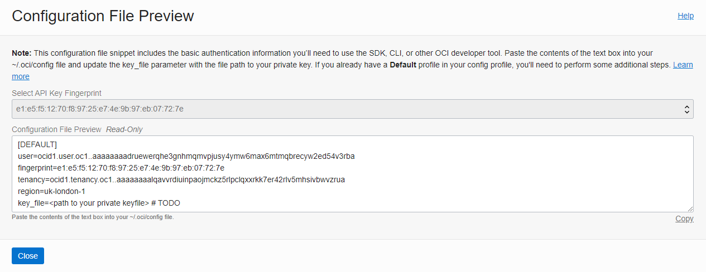
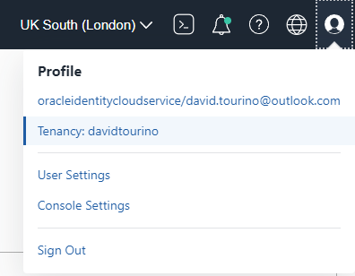
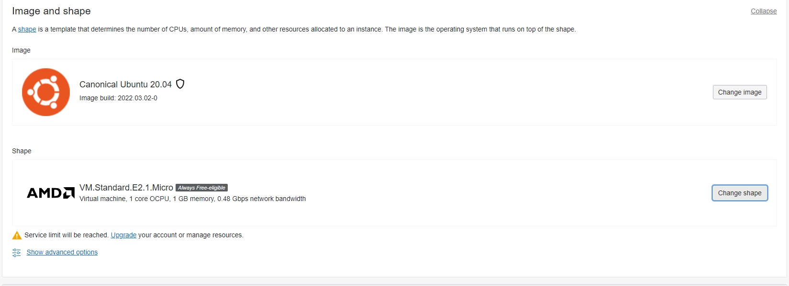

# Secrets
Multiple secrets are used in the project. Most of them used during CI processes. But some other for the application.

The secrets are managed by Github Secrets.

## External tools tokens

### DOCKERHUB_TOKEN

Token used to upload to [the docker hub](https://hub.docker.com/u/davidtca) the produced artifacts. 
 * [The jar application](./jobs.md#PrepareImage) 
 * [The custom caddy build](./jobs.md#SetUpCaddy)

It looks like an uuid
    
    97963003-29b6-4484-9dae-6a9c7beda9df

Another token can be generated at the dockerhub settings

### DUCKDNS_TOKEN

The token is used to link the current machine IP to the Duckdns domain. 
Useful to automate the recreation of the instance. 
It's used on the [PrepareOracleCLoud job](./jobs#PrepareOracleCLoud) after the ip is obtained

It looks like an uuid

    97963003-29b6-4484-9dae-6a9c7beda9df

The token is one per user at the duckdns site. The domain is linked to this same GitHub account

### SNYK_TOKEN
This token serves to realise the analisis by the [Snyk Job](./jobs#Snyk). The report is uploaded to the snyk site

As stated in the documentation, [Gradle Kotlin DSL files are not supported by the Github integration](https://app.snyk.io/org/davidtourino/project/fe14ca39-27ff-4f12-b039-32402360d83b)
That's the reason the integration is made by the Snyk CLI in Github actions, which requires the token.

### GITHUB_TOKEN
This token is generated by Github so the workflow has access to publish in branches.

It's used to publish the documentation in the docs branch.

No need to generate a personal access token manually.

## Oracle Cloud CLI secrets

To connect to the Oracle cloud service some secrets and infrastructure details must be configured.

Most of the information here can be found at [in the official documentation](https://docs.oracle.com/en-us/iaas/Content/API/Concepts/apisigningkey.htm)
as the original source of true.

### OCI_FINGERPRINT and OCI_KEY_FILE

To access the console it's needed to create a RSA pair of public/private in PEM format. It can be generated with your 
tool of choice or directly by the oracle cloud web interface.

You can access and create them or upload the public key at the Oracle Cloud Web Console > Profile > User settings > API Keys.

The fingerprint of the public key will be used as a parameter to create the session in the Oracle CLI.

Adding a new API Key this way will provide the configuration file with some of the values required and explained below.

### OCI_REGION

Region of the Oracle cloud to be deployed into. The region is linked to the account the moment of registration.

List of regions can be found at [the official site](https://docs.oracle.com/en-us/iaas/Content/General/Concepts/regions.htm )

### OCI_TENANCY
Identifier of the tenancy for this account. The tenancy is the partition in the Oracle cloud where the account can create resources.
It's created on sing up.

The tenancy OCID can be found in the AWS console: Profile > Tenancy

### OCI_USER_OCID

User identifier accessing through the oracle cloud command line interface. In the web console, the OCID can be
obtained in the user settings.

Although the recommended way would be creating a user specific for integrations, I'm using my personal user for simplicity.

Further information can be found [in the official documentation](https://docs.oracle.com/en-us/iaas/Content/API/Concepts/apisigningkey.htm#three)

## VM Infrastructure settings
The following secrets will be related to the deployment and the infrastructure where the application is deployed. 
It's not related to the console configuration like the previous ones.

### VM_CUSTOM_IMAGE_OCID

This is the identifier of the image used to instantiate the computer instance, for example an Ubuntu 20.
The identifier of the image depends on the image, build and region.

The full list of OCIDs for images [are listed here](https://docs.oracle.com/en-us/iaas/images/)
It's needed to enter on the _Read more_ section to see the OCIDs for each region

### VM_SHAPE

This is the shape of the compute instance created. It's a template that will determine the number of CPUs, amount of memory
and other resources allocated. 

While creating an instance on the web console, it's the name displayed for the selected shape, like the **VM.Standard.E2.1.Micro**

### VM_SSH_PRIVATE_KEY and VM_SSH_PUB_KEY
These are another pair of RSA public key / private key generated for the instance being deployed. 

It's important not to confuse it with the [OCI_KEY_FILE](.#oci_fingerprint-and-oci_key_file), since that's the CLI key 
pair and this one is the pair used for the machine being deployed. That's why we need the two keys too, while the public
key for the CLI is stored at the cloud and not in this pipeline.

### VM_SUBNET_OCID

### VM_AVAILABILITY_DOMAIN

### VM_COMPARTMENT_OCID

