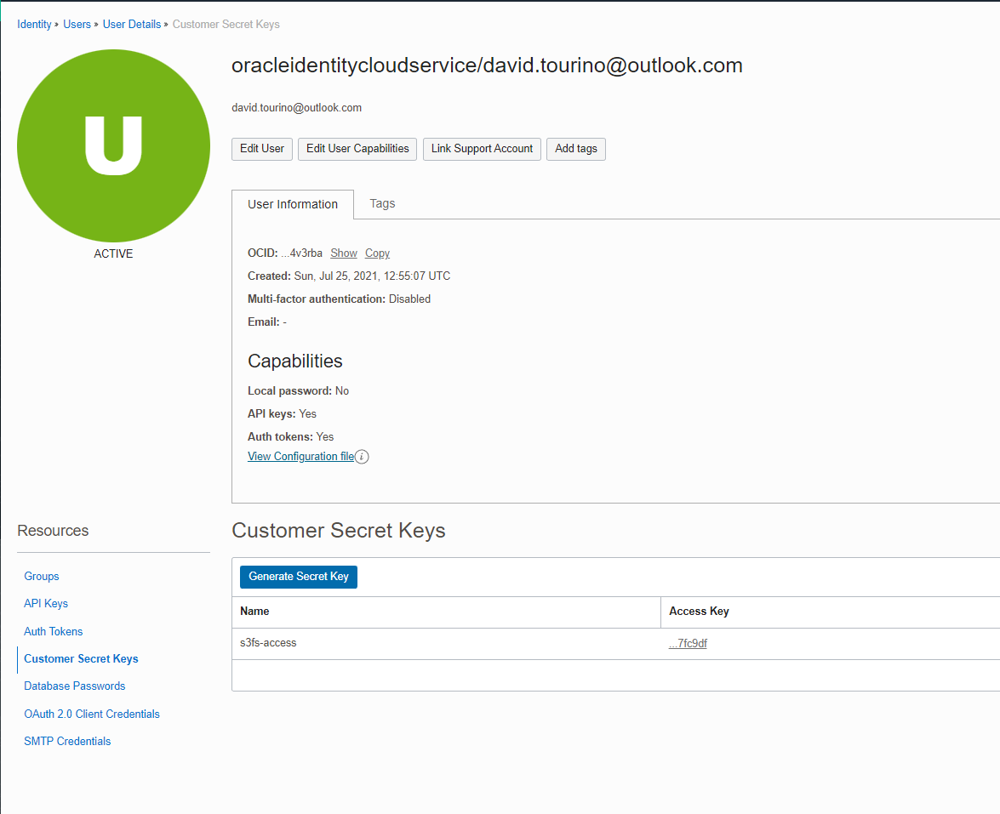
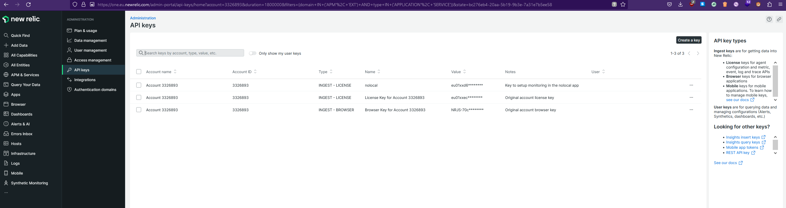

# Secrets
Multiple secrets are used in the project. Most of them used during CI processes. But some other for the application.

The secrets are managed by Github Secrets.

## External tools tokens

### DOCKERHUB_TOKEN

Token used to upload to [the docker hub](https://hub.docker.com/u/davidtca) the produced artifacts. 

 * [The docker image with the jar application](./jobs.md#PrepareImage) 
 * [The custom caddy build](./jobs.md#SetUpCaddy)

It looks like an uuid
    
    97963003-29b6-4484-9dae-6a9c7beda9df

Another token can be generated at the dockerhub settings

### DUCKDNS_TOKEN

The token is used to link the current machine IP to the Duckdns domain. 
Useful to automate the recreation of the instance. 
It's used on the [PrepareOracleCLoud job](./jobs#PrepareOracleCLoud) after the ip is obtained

It looks like an uuid

    97963003-29b6-4484-9dae-6a9c7beda9df

The token is one per user at the duckdns site. The domain is linked to this same GitHub account

### SNYK_TOKEN
This token serves to realise the analisis by the [Snyk Job](./jobs#Snyk). The report is uploaded to the snyk site

As stated in the documentation, [Gradle Kotlin DSL files are not supported by the Github integration](https://app.snyk.io/org/davidtourino/project/fe14ca39-27ff-4f12-b039-32402360d83b)
That's the reason the integration is made by the Snyk CLI in Github actions, which requires the token.

### GITHUB_TOKEN
This token is generated by Github so the workflow has access to publish in branches.

It's used to publish the documentation in the docs branch.

No need to generate a personal access token manually.

## Oracle Cloud secrets

To connect to the Oracle cloud service some secrets and infrastructure details must be configured.

Most of the information here can be found at [in the official documentation](https://docs.oracle.com/en-us/iaas/Content/API/Concepts/apisigningkey.htm)
as the original source of true.

### INFRA_FINGERPRINT and INFRA_KEY_CONTENT

To access the console it's needed to create a RSA pair of public/private in PEM format. It can be generated with your 
tool of choice or directly by the oracle cloud web interface.

You can access and create them or upload the public key at the Oracle Cloud Web Console > Profile > User settings > API Keys.

The fingerprint of the public key will be used as a parameter to create the session in the Oracle CLI.

Adding a new API Key this way will provide the configuration file with some of the values required and explained below.

### INFRA_REGION

Region of the Oracle cloud to be deployed into. The region is linked to the account the moment of registration.

List of regions can be found at [the official site](https://docs.oracle.com/en-us/iaas/Content/General/Concepts/regions.htm )

### INFRA_TENANCY
Identifier of the tenancy for this account. The tenancy is the partition in the Oracle cloud where the account can create resources.
It's created on sing up.

The tenancy OCID can be found in the AWS console: Profile > Tenancy

And it will look something like this:
    
    ocid1.tenancy.oc1..aaaaaaaapmqwjhsyggcyrvqxytrpgsfsqsvsrnnrmpnxmhjukpykajvnjdjj

### INFRA_USER_OCID

User identifier accessing through the oracle cloud command line interface. In the web console, the OCID can be
obtained in the user settings.

Although the recommended way would be creating a user specific for integrations, I'm using my personal user for simplicity.

And it will look something like this:

    ocid1.user.oc1.aaaaaaaapmqwjhsyggcyrvqxytrpgsfsqsvsrnnrmpnxmhjukpykajvnjdjj

## S3 Secrets
Some secrets are needed to create an S3-compatible bucket in the oracle cloud. Details of this implementation can be 
found at [the persistence section](../persistence.md)

### S3_BUCKET_NAME
This is the name of the bucket created in the oracle cloud

### S3_ACCESS_KEY_ID & S3_ACCESS_SECRET 
This pair is generated through the user settings in the oracle cloud. Is used as a user/password to access the S3 bucket 
from the container.

To create it, go to the oracle cloud > User Settings > Customer secret keys > Generate Secret Key

### S3_URL
This is the url of the bucket in where the dump will be stored. It follows the structure of an oracle cloud bucket with
a compatible S3 api, so it looks like:

    https://<namespace>.compat.objectstorage.<region>.oraclecloud.com/

[Cloud Object Storage URI Formats](https://docs.oracle.com/en-us/iaas/autonomous-database/doc/cloud-storage-uris.html)
[Understanding Object Storage Namespaces](https://docs.oracle.com/en-us/iaas/Content/Object/Tasks/understandingnamespaces.htm)

### NEWRELIC_KEY
Secret key of the new relic agent for java applications. Originally located in the file [newrelic.yml](..%2F..%2F..%2Fnewrelic.yml)
Obtained in the new relic cloud page to send application metrics and logs to be monitored.

[Monitoring a java application in docker with New Relic](https://docs.newrelic.com/install/java/?deployment=docker)

## VM Infrastructure settings
The following secrets will be related to the deployment and the infrastructure where the application is deployed. 
It's not related to the console configuration like the previous ones.

### INFRA_AUTHORIZED_KEYS, INFRA_SSH_PRIVATE_KEY
This is the authorized keys, private key pair to allow connections to the instance deployed.

It's important not to confuse it with the [OCI_KEY_FILE](.#oci_fingerprint-and-oci_key_file), since that's the CLI key 
to access the console and this one is the authorized keys used for the machine being deployed. 

The authorized keys is needed to create the instance, while the private key is used in the Deploy step to connect to 
the instance and deploy it.

### INFRA_AVAILABILITY_DOMAIN
The Availability Domain in which the instance will reside. 

The Availability domain is randomized by tenancy and data center. So to list the list of availability domains the 
console or the SDK must be used, for example: 

    datocal@cloudshell:~ (<region>)$ oci iam availability-domain list
    {
        "data": [
            {
                "compartment-id": <compartment-ocid>,
                "id": <availability-domain-ocid>,
                "name": <availability-domain-name>
            },
            {
                "compartment-id": <compartment-ocid>,
                "id": <availability-domain-ocid>,
                "name": <availability-domain-name>
            },
            {
                "compartment-id": <compartment-ocid>,
                "id": <availability-domain-ocid>,
                "name": <availability-domain-name>
            }
        ]
    }

This secret will be the name of the availability domain, for example:

    UOCM:PHX-AD-1

In the Free Tier, the availability domain is restricted to a specific one.

More information about this can be found 
[in the official documentation.](https://docs.oracle.com/en-us/iaas/Content/General/Concepts/regions.htm)

