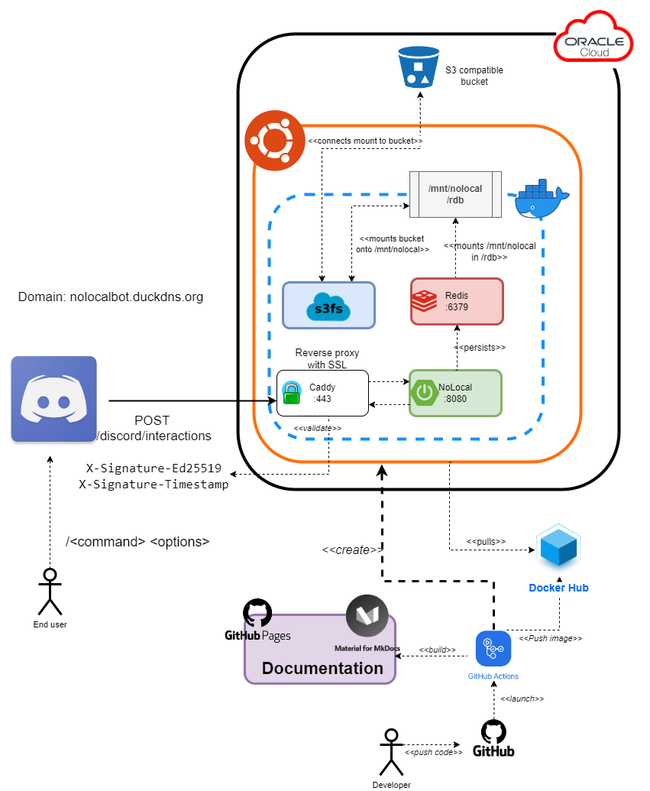

# Quickstart

## The Big Picture 

## Tech stack

| Technology     | Type                  | Description                                                                        | Reference                                      |
|----------------|-----------------------|------------------------------------------------------------------------------------|------------------------------------------------|
| Kotlin         | Language              | Modern JVM based language with full java compatibility                             | [Link](https://kotlinlang.org/)                |
| Spring Boot    | Framework             | Robust and known framework to make the magic happens :)                            | [Link](https://spring.io/projects/spring-boot) |
| Gradle         | Build Tool            | Tool to build the project, with all the tasks related to compile, test and more    | [Link](https://gradle.org/)                    |
| Github Actions | CI/CD                 | Tool to orchestrate the checks, deploy and everything happening after a commit     | [Link](https://github.com/features/actions)    |
| Sonarcloud     | Quality Analysis      | Tool to analyse the project to detect quality improvements (code smells, bugs...)  | [Link](https://sonarcloud.io/)                 |
| MkDocs         | Static site generator | Tool to generate a static site for documentation                                   | [Link](https://www.mkdocs.org/)                |
| Oracle Cloud   | Hosting               | Cloud provider of this service deployment (free tier)                              | [Link](https://www.oracle.com/cloud/)          |
| Uptime Robot   | Monitoring            | Monitor to check the health of the application periodically by external http calls | [Link](https://uptimerobot.com/)               |
| New Relic      | Monitoring            | Advanced monitoring from application metrics and log ingestion using a java agent  | [Link](https://docs.newrelic.com//)            |

## Building it

To build the executable jar, just run:

    ./gradlew build

This command will generate the jar output under build/libs

## Running it

Just do:

    ./gradlew bootRun

Or even simplier
    
    java -jar nolocal.jar

## Testing it 
All the tests are under the check task in gradle, so to run all the suite run:

    ./gradlew check

### Integration testing
Integration tests are mixed with the unit tests, but on the infrastructure package.
Originally, there was a split creating a separate module for the integration tests, but maintaining the gradle file was
more difficult than the actual benefits of having it separated.

### Mutation testing
You can run the mutation testing too! to do that, simply run
    
    ./gradlew pitest

This will generate a report under build/reports/pitest/

In addition to this, the project has a job to generate the pitest report from 
[GitHub](https://github.com/datocal/nolocal/actions/workflows/mutation.yml )