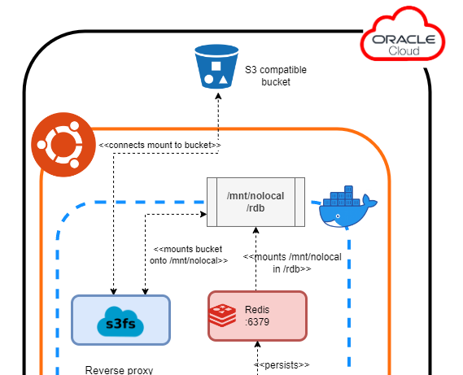

# Persistence

Persistence is done by a redis container. Redis has [multiple strategies](https://redis.io/docs/management/persistence/)
to write data to disk. The chosen one is the default persistence, Redis Database (RDB). 
By default it will save snapshots of the dataset each 60 seconds. It may seem weak, but it should not be an issue at all,
worst case scenario would be a lost of 60 seconds of data and with few users it will be acceptable.

However, having the redis dockerized inside a Virtual Machine forces to maintain a process to keep the data in another
point to be able to destroy the machine and create another. That's where several technologies come into play:

 * **Redis**: The official [redis](https://redis.io/) image [from dockerhub](https://hub.docker.com/_/redis/).
 * **Oracle Object Storage**: AWS S3 like bucket. Used to store the redis dumps.
 * **S3FS**: Tool to mount S3 buckets into a file system.
 * **Docker volumes**: A volume is created from a container using s3fs linking the host with the bucket. Another mount is
 made to link that host's folder to the redis container.

Related info:
 * [Overview of Object Storage](https://docs.oracle.com/en-us/iaas/Content/Object/Concepts/objectstorageoverview.htm)
 * [Mounting Object Storage buckets using s3fs](https://docs.oracle.com/en-us/iaas/Content/Object/Tasks/s3compatibleapi.htm#Supported_Amazon_S3_Clients)
 * [Official s3fs-fuse repository](https://github.com/s3fs-fuse/s3fs-fuse)
 * [Dockerized s3fs-fuse implementation](https://github.com/efrecon/docker-s3fs-client)

## Compose explanation
The following code is a valid configuration to use the bucket as a volume: 

      s3fs:
        image: 'efrecon/s3fs:1.91'
        container_name: s3fs
        devices:
          - /dev/fuse
        cap_add:
          - SYS_ADMIN
        security_opt:
          - 'apparmor:unconfined'
        stop_signal: SIGINT
        volumes:
          - '/mnt/nolocal:/opt/s3fs/bucket:rshared'
        environment:
          - AWS_S3_BUCKET
          - AWS_S3_MOUNT
          - AWS_S3_ACCESS_KEY_ID
          - AWS_S3_SECRET_ACCESS_KEY
          - AWS_S3_URL
          - S3FS_ARGS
          - S3FS_DEBUG
          - UID
          - GID

 * **image**: The image version [generated automatically](https://github.com/efrecon/docker-s3fs-client#versions-and-tags)
based on the s3fs implementation, so it will keep up to date.
 * **devices, cap_add & security_opt**: Make sure the container will be able to make availablo the S3 bucket
 * **stop_signal**: By default, this image is prepared to be launched by docker-run, so it waits for the Ctrl+C (SIGINT)
signal. Docker compose automatically sends SIGTERM on docker termination (by for example, a docker-compose stop command)
This way the signal is overwritten and the container handles the termination correctly. Failing to do so will leave the mount in
an inconsistent state.
 * **volumes**: The left one will be the host mount point while de right one the docker one. 
rshared makes the volume available to the host and other containers.
 * **environment**: Some of them are explained on [the secrets section](./ci/secrets.md). For the other ones:
   * **S3FS_ARGS**: Two options are passed to S3FS:
     * use_path_request_style: Mandatory to use S3-compatible implementations instead of an AWS S3 official bucket
     * allow_other: Used to be able to access the mount outside the s3fs container.
   * **UID & GID**: UID & GID of the redis user and group created in the redis container. This will make a chown and will
   let redis access to the mount.